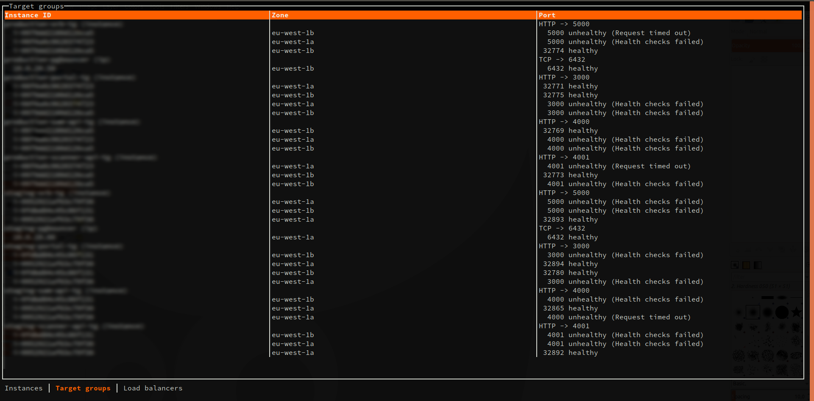

# ser :cheese:

Ser is a small monitoring tool for your AWS instances, targets groups, load balancers, ECS.



## Usage
```
ser <aws-profile-name> <region>
```
Default region is `eu-west-1`

## Policy

```json
{
    "Version": "2012-10-17",
    "Statement": [
        {
            "Sid": "VisualEditor0",
            "Effect": "Allow",
            "Action": [
                "ec2:DescribeInstances",
                "ec2:DescribeTags",
                "ec2:DescribeInstanceAttribute",
                "ec2:DescribeInstanceStatus",
                "elasticloadbalancing:DescribeLoadBalancers",
                "elasticloadbalancing:DescribeTargetGroups",
                "elasticloadbalancing:DescribeTargetHealth"
            ],
            "Resource": "*"
        }
    ]
}
```
